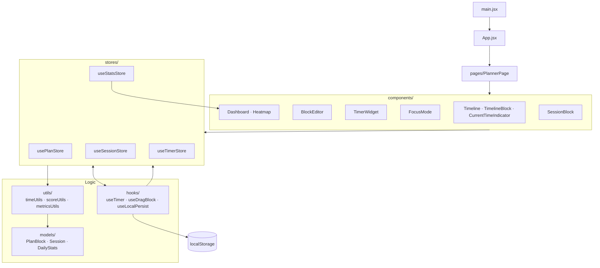

# Architecture

A client-side React + Vite app (Zustand-style stores, Tailwind) that compares planned focus blocks to real sessions. Data persists in the browser.

```mermaid
flowchart TD
    Main[main.jsx] --> App[App.jsx] --> Planner[pages/PlannerPage]

    subgraph UI["components/"]
        TL[Timeline · TimelineBlock · CurrentTimeIndicator]
        BE[BlockEditor]
        TW[TimerWidget]
        FM[FocusMode]
        Dash[Dashboard · Heatmap]
        SB[SessionBlock]
    end

    subgraph Stores["stores/"]
        Plan[usePlanStore]
        Sess[useSessionStore]
        Timer[useTimerStore]
        Stats[useStatsStore]
    end

    subgraph Logic
        Hooks["hooks/<br/>useTimer · useDragBlock · useLocalPersist"]
        Utils["utils/<br/>timeUtils · scoreUtils · metricsUtils"]
        Models["models/<br/>PlanBlock · Session · DailyStats"]
    end

    LS[(localStorage)]

    Planner --> UI
    UI --> Stores
    Hooks --> Stores
    Stores --> Utils --> Models
    Stats --> Dash
    Stores <--> Hooks
    Hooks --> LS
```
